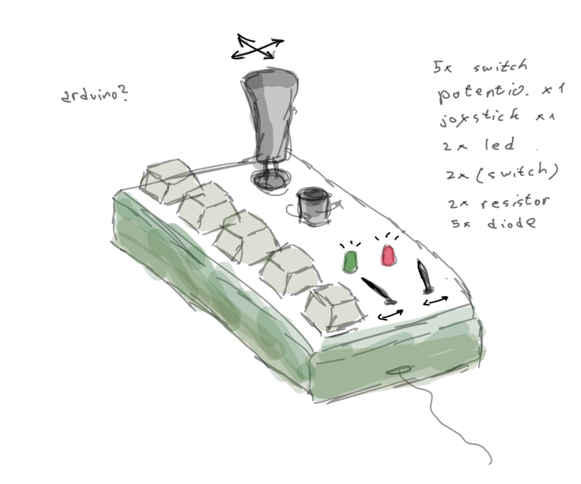
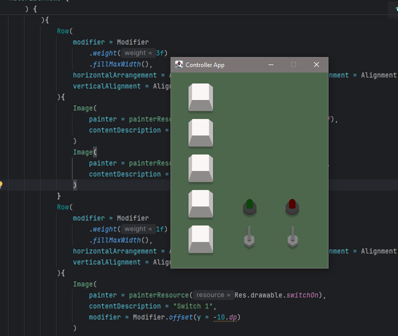
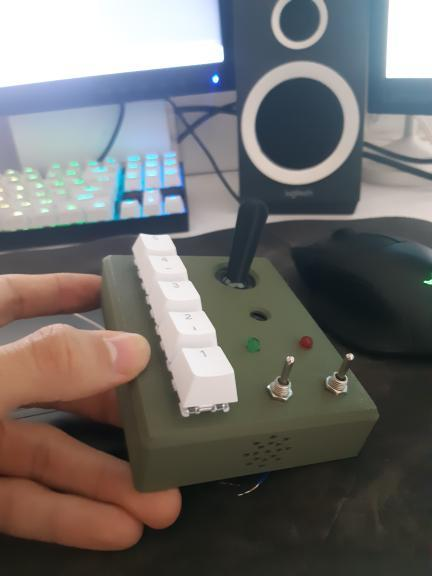

# 🎮 Gamepad: Compose Multiplatform Controller

This was my final school year project. We had to make both software, firmware and device. I created cool little device that can be connected
to your computer and used as macro pad or controller for game(that I will hopefully make in future).

This is the basic version, I didn't have time to add joystick functionality but LEDs and switches work awsome.

I created simple desktop app in Compose Multiplatform too, which allow you to control device's LED.
Also, when you do something on device it reflects actions
in software too(animations on buttons, switches, leds). It is very simple system. I used rpi pico as my microcontroller, but you can really just
use any microcontroller with ADC pins. My future plan is to create custom PCB to make everything much cleaner.

Basically, Arduino code(desktopMain/arduino/controller.ino) prints some values on Serial output and Kotlin reads those values, and based on them, it knows
which button is pressed and so on...

## 📸 Gallery

Here are some pictures of controller, software and video demonstration.

it all started with some design

then some coding

then I created cool military styled 3d printed case...

